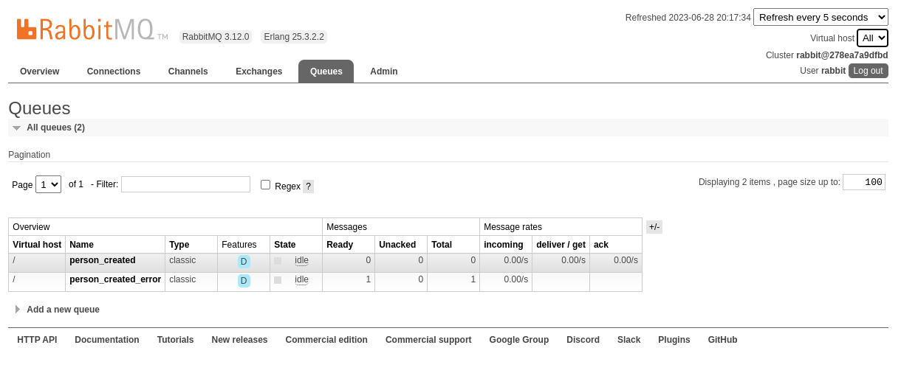
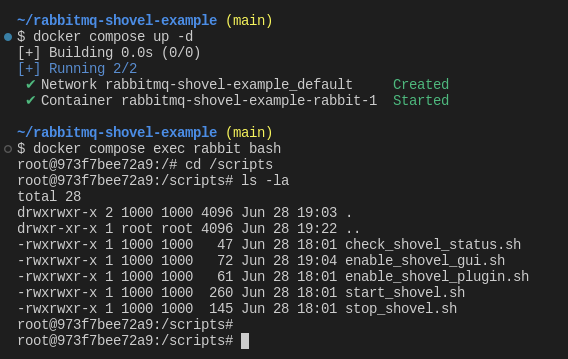
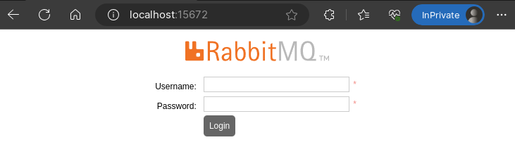
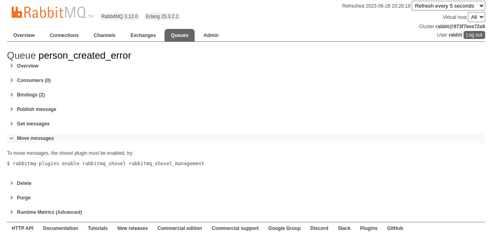
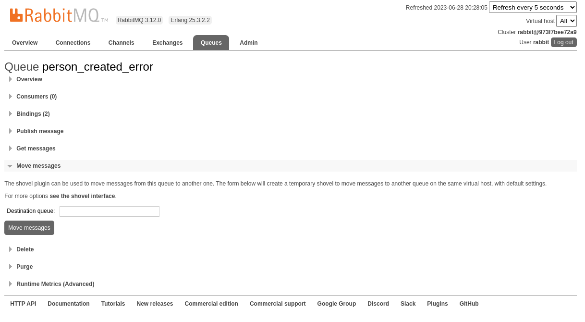
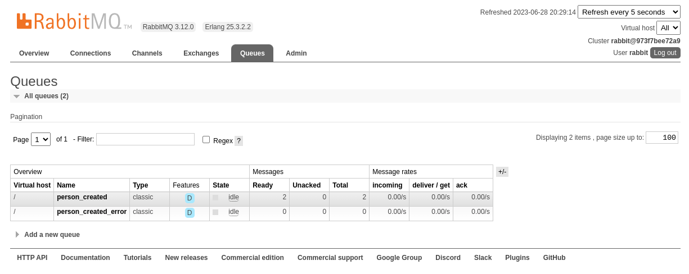

# Rabbit MQ Shovel Example

Demonstrates ways to move messages from one Rabbit MQ queue to another.



---

## Repo Summary

- A `docker-compose.yml` file to initiate a Rabbit MQ container.

- `app/` folder contains:
   - An example application that produces messages to a RabbitMQ instance.
   - An example application that consumes messages from the RabbitMQ instance (badly).
      - This will be used to populate an "error" queue.

- `scripts/` folder contains:
   - Scripts related to the RabbitMQ Shovel plugin.
      - enable_shovel_plugin.sh
      - start_shovel.sh
      - stop_shovel.sh
      - check_shovel_status.sh
   - Scripts related to moving messages from one queue to another solely within the web interface.
      - enable_shovel_gui.sh

---

## Starting the Rabbit MQ Container

To run the container using docker-compose, do the following
```bash
# Host machine, from root of repo
docker compose pull
docker compose up -d
```

After running the `docker compose up -d` command from the root of the repository, each of the `.sh` scripts in 
the `scripts/` folder will be mounted in the RabbitMQ container at the `/scripts` directory.
```bash
# Host machine, from root of repo where the previous commands were called
docker compose exec rabbit bash

# Inside the container
cd /scripts
ls -la
# ... Invoke the scripts as necessary
```



While the docker compose environment is running, the RabbitMQ management web interface will be accessible on the
host machine at port `15672`.
- URL: `http://localhost:15672`
- Username: `rabbit`
- Password: `rabbit`



---

## Example: Creating a shovel using the command line
1. Clone the repo
1. Start the RabbitMQ container
   ```bash
   # In a new terminal window, from root of repo:
   docker compose pull
   docker compose up -d
   docker compose exec rabbit bash

   # In the spawned container
   cd /scripts
   # ... do not close this terminal, we need it later
   ```
1. Start the Consumer project
   ```bash
   # In a new terminal window, from root of repo:
   cd ./app/RabbitMqShovelExample.Consumer
   dotnet run
   ```
   - This will attempt to consume the messages; though they will all be sent to the `person_created_error` queue.
1. Start the Producer project
   ```bash
   # In a new terminal window, from root of repo:
   cd ./app/RabbitMqShovelExample.Producer
   dotnet run

   # ... After a few seconds, stop the application.
   CTRL+C
   ```
1. Go back to the terminal containing the Consumer project
   ```bash
   # Stop the application
   CTRL+C
   ```
1. Open the RabbitMQ web interface, login, go to the queues.
   - The two queues should be created: `person_created`, `person_created_error`.
   - All records should be in the `person_created_error` queue.
1. Go back to the terminal containing the RabbitMQ container.
   ```bash
   # Assuming the steps are followed, you will be in /scripts.
   #  ... If not, cd to `/scripts`.

   # Enable the shovel plugin.
   ./enable_shovel_plugin.sh

   # Start the shovel to move items from `person_created_error` to `person_created`.
   # Important that the consumer is stopped at this point, or it will keep moving
   # items back to the `person_created_error` queue.
   ./start_shovel.sh

   # Check the status of the shovel, should see our new shovel.
   ./check_shovel_status.sh
   ```
1. Go back to the RabbitMQ web interface, go to queues again.
   - All items should be in the `person_created` queue.
   - The `person_created_error` queue should be empty.
1. Go back to the terminal containing the RabbitMQ container.
   ```bash
   # Stop the shovel plugin.
   # This prevents the shovel indefinitely moving messages from the ERROR queue
   # to the main queue.
   ./stop_shovel.sh

   # Check the status of the shovel, should no longer exist.
   ./check_shovel_status.sh
   ```

---

## Example: Moving messages using the web interface
1. Clone the repo
1. Start the RabbitMQ container
   ```bash
   # In a new terminal window, from root of repo:
   docker compose pull
   docker compose up -d
   docker compose exec rabbit bash

   # In the spawned container
   cd /scripts
   # ... do not close this terminal, we need it later
   ```
1. Start the Consumer project
   ```bash
   # In a new terminal window, from root of repo:
   cd ./app/RabbitMqShovelExample.Consumer
   dotnet run
   ```
   - This will attempt to consume the messages; though they will all be sent to the `person_created_error` queue.
1. Start the Producer project
   ```bash
   # In a new terminal window, from root of repo:
   cd ./app/RabbitMqShovelExample.Producer
   dotnet run

   # ... After a few seconds, stop the application.
   CTRL+C
   ```
1. Go back to the terminal containing the Consumer project
   ```bash
   # Stop the application
   CTRL+C
   ```
1. Open the RabbitMQ web interface, login, go to the queues.
   - The two queues should be created: `person_created`, `person_created_error`.
   - All records should be in the `person_created_error` queue.
1. Open the `person_created_error` queue, scroll down to "Move messages" and expand the section.
   - The screen displays a command that must be run to enable moving messages.
      
1. Go back to the terminal containing the RabbitMQ container.
   ```bash
   # Assuming the steps are followed, you will be in /scripts.
   #  ... If not, cd to `/scripts`.

   # Enable the option to move messages within the web interface.
   ./enable_shovel_gui.sh
   ```
1. Go back to the RabbitMQ web interface, go to queues again, open the `person_created_error` queue.
   - The section underneath "Move messages" should now contain a textbox to enter the name of a queue to move all messages to.
      
   - Enter `person_created` inside the textbox, click "Move messages".
   - This will navigate back to the list of queues, and the messages will still be in the `person_created_error` queue.
      
   - After a few seconds, all messages will move from the `person_created_error` queue to the `person_created` queue.
      
   - Since the consumer application was stopped above, the messages will remain in the `person_created` queue.
      - If this is not the case, make sure the consumer application is stopped and then attempt to move the messages again.
